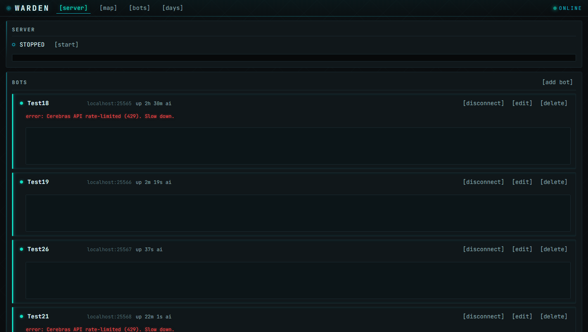
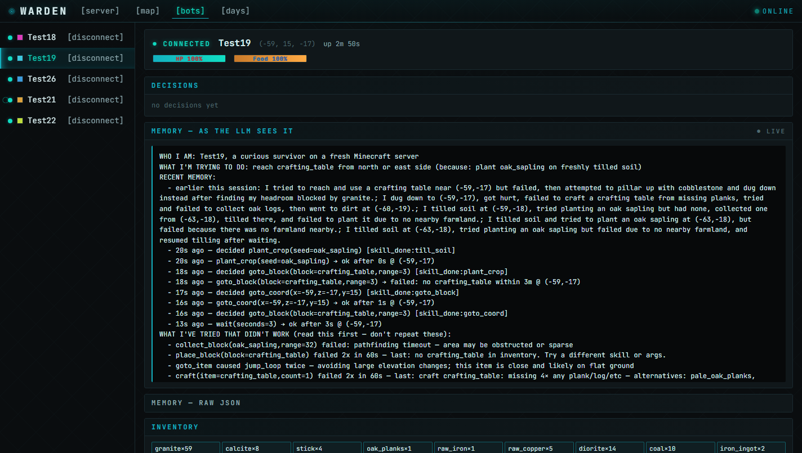
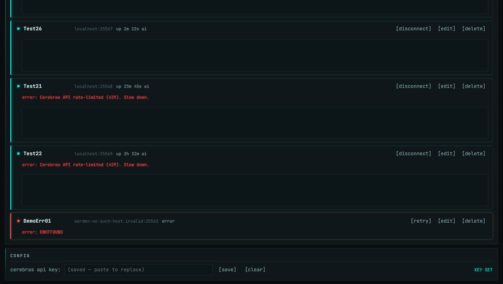

# warden

> the operational layer for LLM-driven Minecraft bot fleets

voyager and mindcraft are the brain. **warden** is what wakes you at 3am when
hour 18 goes sideways. dashboard + watchdog + atomic slot recycle +
snapshot-before-wipe + disk surveillance + brain hardening. the things that
break at hour 18 of a 27-hour run.

named after [the Minecraft mob](https://minecraft.wiki/w/Warden) that senses
disturbances across the world and responds — which is roughly what this
project does for your bot fleet.

> [!warning]
> **early release.** this is research-grade software extracted from a working
> personal setup. it does run 5 bots in parallel for 24+ hours without manual
> intervention, but it has rough edges, hardcodes a single LLM provider
> (Cerebras), and assumes a fixed slot layout. PRs welcome.

```
┌─ dashboard (8080)  ──────────────────┐    ┌─ live page ─┐
│ create / rename / connect / wipe     │    │  vercel +   │
│ live state · WS push · /api/admin    │◄──►│ cloudflared │
│ disk watch · snapshots · recycle     │    │   tunnel    │
└──────────────┬───────────────────────┘    └─────────────┘
               │
               ▼
┌─ N mineflayer bots ──────────────────┐    ┌─ watchdog ────┐
│ brain.js — LLM-driven decision loop  │    │ heartbeat-    │
│ skill library — craft, dig, goto, …  │◄──►│ aware health  │
│ player-memory — append-only json     │    │ checks +      │
│ pathfinder — mineflayer-pathfinder   │    │ atomic recycle│
└──────────────────────────────────────┘    └───────────────┘
```

## the dashboard

themed after the Deep Dark biome — sculk veins, ribcage cyan, shrieker amber.
the connection indicator heartbeat-pulses while the fleet is alive; cards emit
a sculk-sensor ripple when their state changes; an amber shrieker pulse fires
on errors. respects `prefers-reduced-motion`.







## what it actually solves

projects like [Mindcraft](https://github.com/mindcraft-bots/mindcraft) and
[Voyager](https://github.com/MineDojo/Voyager) handle the "LLM picks the next
skill" part well. they don't (and don't try to) handle:

- **chat-spam kicks** — PaperMC kicks you for >3 messages/sec; the LLM doesn't
  know that
- **worldborder safety** — `goto_coord(z=3000)` on a 250-block world is
  pathfinder roulette
- **silent-fail loops** — disk-full, LLM 402, pathfinder-aborted-after-45s
- **fleet management** — 5 java processes + 5 bots, atomic slot recycle on stuck
- **disconnect storms** — one chunk crashes the protocol parser, watch the
  reconnect cascade
- **cross-bot fate-sharing** — sync stderr from one bot starves the event loop
  for all 5
- **disk surveillance** — your C: drive going to 0% silently wedges every brain

warden is the layer that handles those. think of it as the kubernetes for your
minecraft AI bots, except it's a few thousand lines of plain javascript and
runs on your laptop.

## quickstart

```bash
git clone https://github.com/josephg29/warden.git
cd warden
npm install
cp .env.example .env  # then add your CEREBRAS_API_KEY
npm run setup          # downloads paper.jar to data/minecraft-server/ (skip if you have your own)
npm start              # open http://127.0.0.1:8080
```

or via npm:

```bash
npm install mc-warden
```

create a bot in the UI, click connect, and watch it stand in your world. set a
goal in the dashboard ("dig down to bedrock"), and the brain takes over. give it
a few minutes — the first tick is bootstrap-heavy.

## architecture

### the brain (`src/bots/brain.js`)

per-bot LLM decision loop. picks one skill per think cycle from a vocabulary of
~25 skills (`craft`, `goto_coord`, `dig_block`, `place_block`, `pillar_up`,
`look_around`, `attack`, `flee`, `wait`, …). every skill returns
`{ ok, error?, … }`. the brain reads the result, updates `recent_events` in
player-memory, and re-thinks.

production hardening shipped in this repo:

- **hard-block** — `(skill, args)` failing 3+ times in 60s gets blocklisted for
  5 min and surfaced at the top of every prompt
- **completion blindness detector** — same skill succeeding 5+ times with stale
  goal forces a `set_goal: progress` rewrite
- **memory/inventory diff** — pre-craft check against live `bot.inventory.items()`
  before sending args to the LLM
- **oscillation detector** — A-B-A-B alternation between failing skills is one
  block, not two
- **chat throttle** — 3000ms gap on outbound chat (PaperMC anti-spam compliant)
- **worldborder clamp** — `goto_coord` reads worldborder packets and rejects
  out-of-bounds with a clamp suggestion
- **typed LLM errors** — 402/401/429/5xx/network/timeout each routed
  differently; one-shot offline broadcast
- **safe-error reporter** — per-bot rate limit (5/sec) + fleet circuit breaker
  (30/sec → 5s cooldown), all writes async via `setImmediate`

### the operations layer

| component | purpose |
|---|---|
| `src/server/http.js` | dashboard REST + `/api/admin/slots/:n/recycle` |
| `src/server/ws.js` | live state push to the browser |
| `src/diskwatch.js` | poll free MB every 30s, surface on `/api/server` |
| `src/heartbeat.js` | touch `data/dashboard-heartbeat` every 5s |
| `src/snapshot.js` | save inventory + memory + anchors before any wipe |
| `src/admin.js` | atomic slot recycle: snapshot → kill listener PID → wipe → spawn → reconnect |
| `data/overnight/watchdog.mjs` | external health monitor; exits non-zero on dashboard-down |
| `scripts/cloudflared-watcher.mjs` | detect tunnel URL rotation + redeploy |

### file layout

```
src/
  index.js              entrypoint
  config.js             env-driven config
  heartbeat.js          dashboard liveness file (BUG-009)
  safe-error.js         rate-limited async error reporter (BUG-014)
  diskwatch.js          free-MB polling (BUG-002)
  snapshot.js           pre-wipe state capture (BUG-019)
  admin.js              recycle-slot endpoint (BUG-021)
  store.js              atomic json persistence
  settings-store.js     dashboard-editable runtime settings
  session-logger.js     events.jsonl per session
  logger.js             rotating file logger
  bots/
    manager.js          lifecycle + crud
    instance.js         one mineflayer bot + brain wiring
    brain.js            LLM-driven decision loop
    player-memory.js    persistent per-bot memory
  mc-server/
    manager.js          paper/spigot lifecycle (optional)
  server/
    http.js             express routes
    ws.js               websocket broadcast
public/
  index.html            warden UI (no framework, vanilla ESM)
  css/                  paratheme + app.css
  js/                   api / render / ws / map / main
data/                   per-host runtime data (all gitignored)
  overnight/
    slots.example.json  copy to slots.json for the watchdog
    watchdog.mjs        long-running supervisor
```

see [RUNBOOK.md](./RUNBOOK.md) for operational notes (shell choice, listener-PID
lookup, slot recycle, disk pressure, tunnel rotation, fleet fate-sharing).

## environment

```
CEREBRAS_API_KEY    required for the brain. see https://cloud.cerebras.ai
HOST                default 127.0.0.1
PORT                default 8080
DATA_DIR            default ./data
```

see `.env.example`.

## auth modes

each bot picks one of two:

- **offline** (default) — cracked-style. only works on servers that accept
  unverified usernames (`online-mode=false`, LAN, dev).
- **microsoft** — real account that owns Minecraft. required for any
  public/online-mode server. on first connect the dashboard shows a device
  code; visit https://www.microsoft.com/link to authorise. tokens cache in
  `data/msa-cache/` so subsequent connects are instant. each bot has its own
  cache, so you can sign in to different accounts.

## api (for tinkering)

```
GET    /api/bots
POST   /api/bots                          { name, host, port?, version?, autoStart? }
PATCH  /api/bots/:id                      partial fields
DELETE /api/bots/:id
POST   /api/bots/:id/connect
POST   /api/bots/:id/disconnect
DELETE /api/bots/:id/memory               (must be disconnected)
GET    /api/bots/:id/state                full snapshot
GET    /api/bots/:id/decision             last decision + current skill
POST   /api/bots/:id/snapshot             manual capture
POST   /api/admin/slots/:n/recycle        atomic 11-step restart
GET    /api/server                        disk + mc-server state
PATCH  /api/settings                      runtime settings (e.g. cerebrasApiKey)
```

websocket: `ws://127.0.0.1:8080/ws` — `snapshot` on connect, `bot:upsert` /
`bot:delete` thereafter.

## roadmap

things that should land before this is plug-and-play for newcomers:

- **multi-LLM support** — generalise the OpenAI-compatible client beyond
  Cerebras. mindcraft has a 16-provider abstraction worth borrowing.
- **per-bot subprocess isolation** — currently all bots share one node event
  loop. mitigated via rate-limited error reporter (BUG-014); the proper fix is
  a real refactor.
- **example brain configs** — gathering / building / pvp loadouts as starter
  templates rather than one-size-fits-all.
- **hosted demo / screenshots** — for the README.
- **docker compose** — for `git clone && docker compose up`.

contributions welcome. see [CONTRIBUTING.md](./CONTRIBUTING.md).

## license

MIT — see [LICENSE](./LICENSE).

## acknowledgements

- [mineflayer](https://github.com/PrismarineJS/mineflayer) — the entire bot foundation
- [PrismarineJS](https://github.com/PrismarineJS) — pathfinder, world, protocol
- [Mindcraft](https://github.com/mindcraft-bots/mindcraft) — for proving the
  LLM-skill-library pattern
- [Voyager](https://github.com/MineDojo/Voyager) — for proving the auto-curriculum
  + lifelong-learning idea
